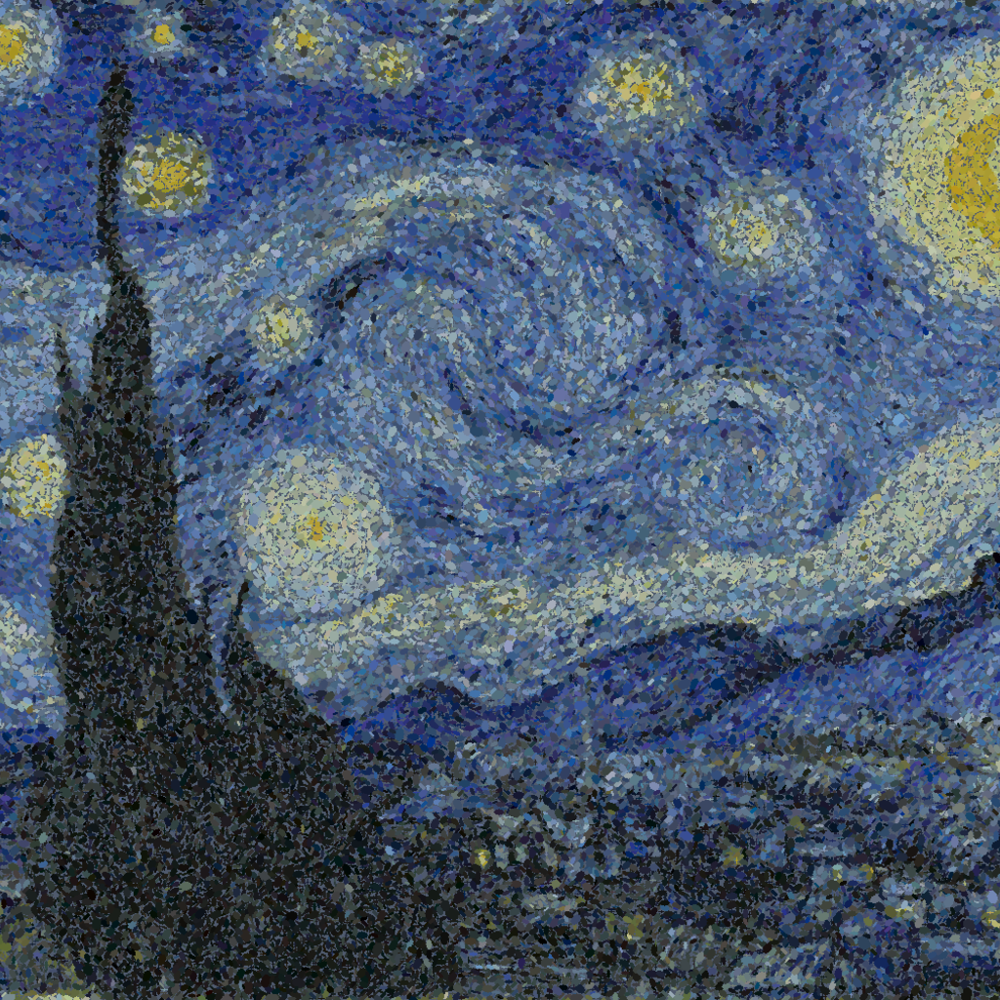
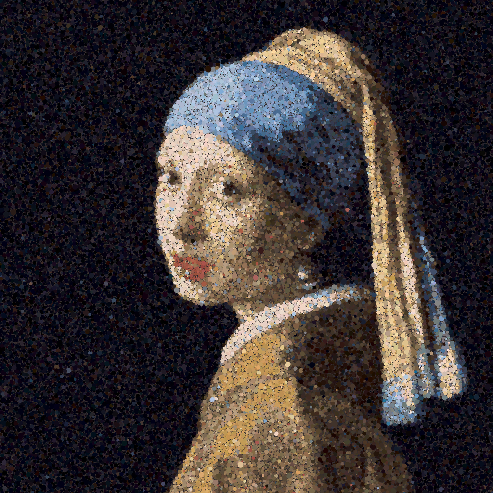
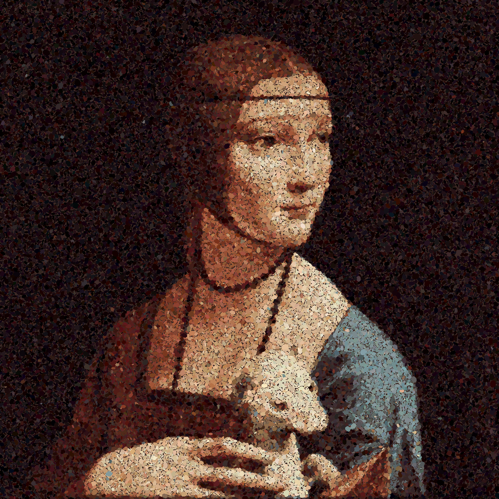
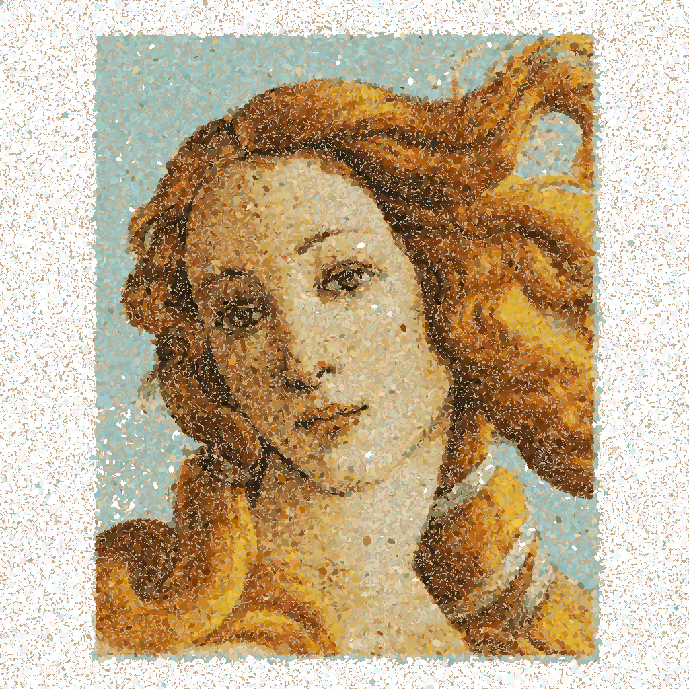
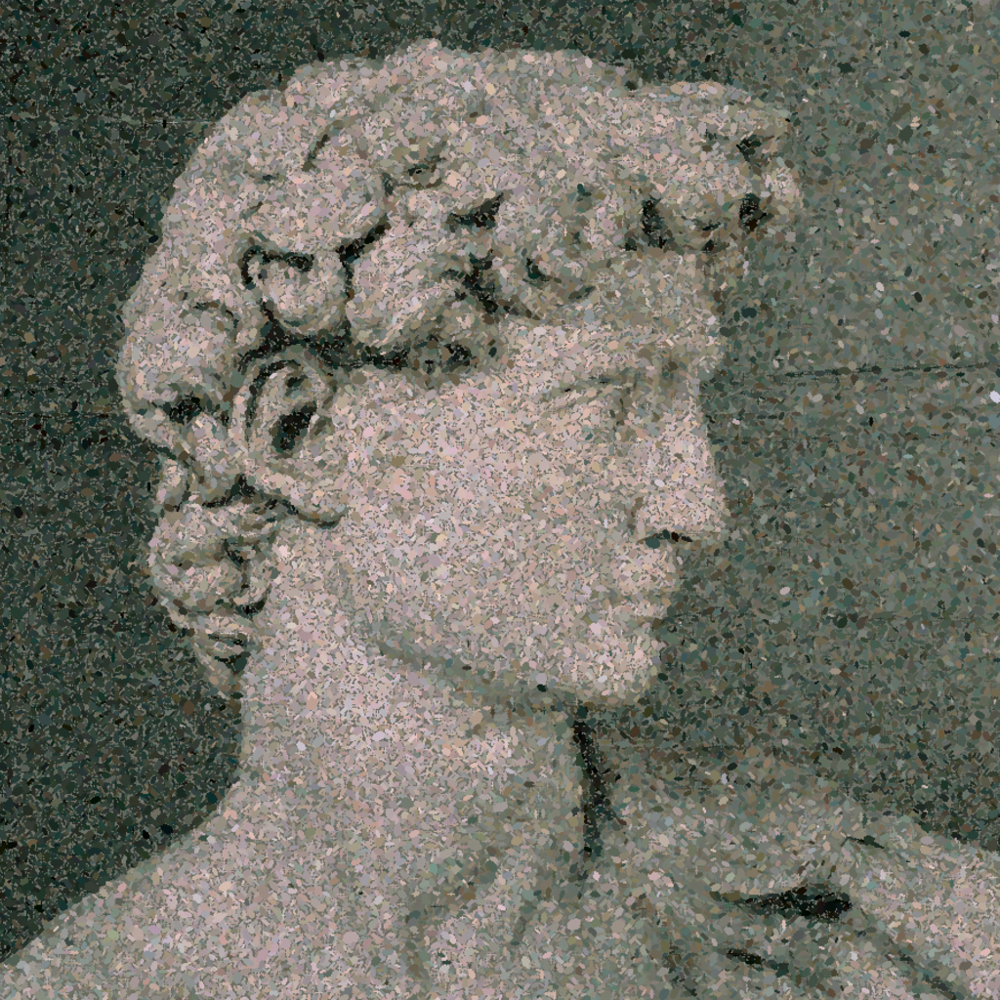

# MonteCarloArt.jl

<p align="center">
  
</p>

MonteCarloArt.jl is a Julia script that recreates images in a pointillist style using a greedy Monte Carlo sampling algorithm. The process begins by extracting a reduced color palette of N colors from the original image. The script then attempts to place small colored strokes — oriented ellipses (sparse-overlap, not disjoint) — onto a blank canvas.

At each step a batch of strokes is proposed in parallel — each at a random position biased toward high-error regions via importance sampling on the residual map. A stroke is committed sequentially iff the average overlap under it is below a fixed threshold:

$$
\text{overlap} = \frac{1}{N} \sum_{p \in \text{points}} \text{penalty}(p)
$$

$$
\text{Draw stroke if} \quad \text{overlap} < \text{overlap-tolerance}
$$

Stroke color is drawn from the palette by softmax sampling on Lab distance (temperature-controlled — argmin at T→0, more uniform mixing at higher T), then jittered per Lab channel to break up flat-poster banding. Over time, this method produces an image with subtle color blending and visual texture, characteristic of pointillist art.

You can control several parameters to influence the output:

1. **`--steps`:** upper bound on algorithm steps (more steps = more strokes)
2. **`--color-palette`:** number of colors in the palette
3. **`--overlap-tolerance`:** mean soft-penalty threshold under a candidate stroke. Higher = denser packing (default 0.15)
4. **`--stop-miss-rate`:** EMA miss-rate threshold for early termination when the canvas saturates (default 0.99; 1.0 = disabled)
5. **`--background`:** canvas background — `white | black | mean | #rrggbb` (default `white`)

Stroke geometry is **edge-aware oriented ellipses**: base radius sampled from a normal distribution scaled to image size; in high-edge regions (Sobel-driven) the ellipse aspect shrinks toward 0.45 and its major axis aligns with the local isophote (perpendicular to the gradient). Flat regions get near-circular strokes with random orientation. Fine detail is preserved by directional strokes; flat regions get chunkier coverage.

Overlap penalty is a **dome-shaped falloff** (1 at circle center, 0 at edge) accumulated on the canvas — softer than binary occupancy, gives natural spacing.

Within a batch, candidates whose centers fall inside an already-accepted candidate's radius are dropped ("batch dedup") — parallel proposals often target the same hot spot.

Parallelism is auto-derived from Julia's thread count (`julia -t N`). Progress logs fire every 5% of `--steps`. Debug logging: `JULIA_DEBUG=MonteCarloArt`.

The script supports gray scale mode and can optionally export the output as an SVG (**if your computer can handle a huge SVG**). Higher-resolution input images generally produce better results.


## Requirements

The following Julia packages are required:

- `ArgParse`
- `Clustering`
- `Colors`
- `Images`


## Usage

Run the script via the command line:

Output format is inferred from the `-o` file extension (`.png` or `.svg`).

```bash
$ julia main.jl --help
usage: main.jl -i INPUT [-o OUTPUT] [--steps STEPS] [-v] [--color]
               [--color-palette COLOR-PALETTE] [-t OVERLAP-TOLERANCE]
               [--stop-miss-rate STOP-MISS-RATE]
               [--background BACKGROUND] [-h]

optional arguments:
  -i, --input INPUT     input image path
  -o, --output OUTPUT   output path with extension (.png/.svg/.gif);
                        comma-separate for multiple (default:
                        "output.svg")
  --steps STEPS         algorithm iteration count (type: Int64,
                        default: 200000)
  -v, --verbose         verbose (debug) logging
  --color               Enable color mode (use input colors instead of
                        grayscale)
  --color-palette COLOR-PALETTE
                        Number of colors in the palette (type: Int64,
                        default: 64)
  -t, --overlap-tolerance OVERLAP-TOLERANCE
                        Mean soft-penalty threshold under a candidate
                        circle. Higher = denser packing. (type:
                        Float64, default: 0.15)
  --stop-miss-rate STOP-MISS-RATE
                        Early stop when EMA of miss rate exceeds this.
                        1.0 = disabled (never stop early). (type:
                        Float64, default: 0.99)
  --background BACKGROUND
                        Canvas background: white | black | mean (image
                        mean color) | #rrggbb (default: "white")
  -h, --help            show this help message and exit

```

Threading is auto-derived from Julia's thread count — run with `-t N`
to parallelize candidate proposals. Debug logging: `JULIA_DEBUG=MonteCarloArt`.


- **Gray Scale Mode:**
```bash
julia -O3 main.jl -i input.jpg -o output.png
```


- **Color Mode with Custom Color Palette:**
```bash
julia -O3 main.jl --color --color-palette 64 -i input.jpg -o output.png
```


- **More Iterative Steps:**
```bash
julia -O3 main.jl --steps 400000 -i input.jpg -o output.png
```


- **Early Stop on Saturated Canvas (~30% wall-time savings):**
```bash
julia -O3 -t 8 main.jl --color --steps 400000 \
    --stop-miss-rate 0.95 -i input.jpg -o output.png
```


- **SVG Output (extension picks the format):**
```bash
julia -O3 -t 8 main.jl --steps 400000 -i input.jpg -o output.svg
```


- **Multiple Outputs (comma-separated, single run):**
```bash
julia -O3 -t 8 main.jl --color --steps 400000 \
    -i input.jpg -o output.png,output.svg
```


- **Custom Background (e.g. dark canvas for night scenes):**
```bash
julia -O3 -t 8 main.jl --color --background black \
    -i input.jpg -o output.png
# also: --background mean | --background '#1a1a2e'
```


- **Animated GIF (replay of committed strokes, snapshot every 100):**
```bash
julia -O3 -t 8 main.jl --color --steps 100000 -i input.jpg -o output.gif
```
Frames = `n_strokes / 100`, playback = 15 fps. File size scales with input resolution × frame count — downsize input for smaller GIFs.


- **Recommended Settings for Higher-resolution (denser packing, higher stroke count):**
```bash
julia -O3 -t 8 main.jl --color --steps 600000 \
    -t 0.25 --stop-miss-rate 0.99 \
    -i input.jpg -o output.png
```


### Gallery

- **Vermeer — *Girl with a Pearl Earring*** (smooth skin gradients + pearl highlight)

<p align="center">
  
</p>


- **Da Vinci — *Lady with an Ermine*** (portrait detail + fur texture)

<p align="center">
  
</p>


- **Botticelli — *The Birth of Venus*** (soft skin + flowing hair, wide tonal range)

<p align="center">
  
</p>


- **Michelangelo — *David*** (monochrome marble — edge-aware stroke stress test)

<p align="center">
  
</p>


### TODO

See `TASKS.md`. Recently shipped: oriented ellipses (edge-aligned via
Sobel gradient), softmax palette pick with Lab-channel jitter,
`--background` option (white | black | mean | #rrggbb), multi-output
via comma-separated `-o`, edge-aware radius, soft dome penalty, batch
dedup, GIF output. Backlog: palette locality (per-region k-means) and
residual-driven color pick (see TASKS.md Task 1) remain candidates if
visual quality still lags.


---

## License

MIT License
